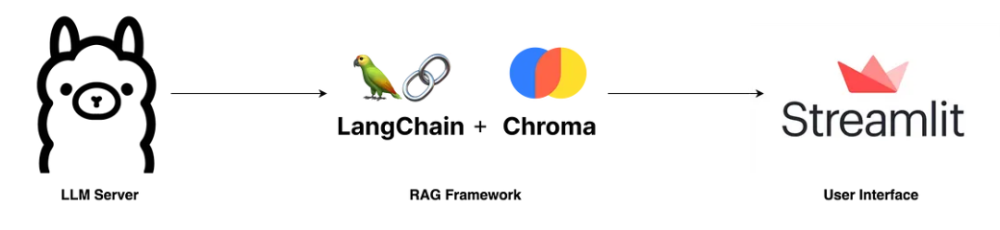

<!-- Improved compatibility of back to top link: See: https://github.com/othneildrew/Best-README-Template/pull/73 -->

 

  <a href="https://github.com/shaileshagarwal1/python-langchain-rag-into-local">
    

      
    

  </a>

<h1 align="center">Running Local RAG based on Langchain, Ollama, Chroma, Streamlit </h1>

  

    Build your own RAG (chatPDF) and run it locally.
  

  

# Langchain RAG Project

This repository provides an example of implementing Retrieval-Augmented Generation (RAG) using LangChain and Ollama. The RAG approach combines the strengths of an LLM with a retrieval system (in this case, FAISS) to allow the model to access and incorporate external information during the generation process.

The application will load any Markdown documents in the `docs/` directory. As an example this directory has two documents on Amazon Bedrock and Knowledge Bases for Amazon Bedrock. Since these products were released in the last 6 months their documentation was not included in the training data for most popular LLMs.

## Ollama

[Ollama](https://github.com/ollama/ollama) is a tool for running large language models locally. Supported models are listed [here](https://ollama.com/library).

## Getting Started

To get started with this example, follow these steps:

Setups:
- install ollama from https://ollama.ai/
- pull the qwen3:1.7b model on ollama using the command `ollama pull qwen3:1.7b`
- install the requirements using `pip install -r requirements.txt`
- run the streamlit app using `streamlit run main.py`

Working:
Here are the key concepts in ingest_rag.py:

1. Added a self.ingested_files set to keep track of files by their hash.

2. The ingest_pdf and ingest_image methods calculate a file hash and skip the ingestion process if the file has already been seen.

3. The _update_vector_store method add documents to an existing vector store instead of creating a new one every time.

4. The clear method reset the ingested_files set.

5. Persistence and Deduplication: The ingested_files set and the _get_file_hash method are crucial for building a persistent and efficient application. This ensures that:

    a. Embeddings are generated only for new documents, avoiding redundant processing.

    b. The vector_store is not reset every time a new file is uploaded, allowing the system to build on its existing knowledge base.

6. Configurable Retrieval Parameters: The search_kwargs dictionary (k and score_threshold) exposes critical knobs for tuning the retrieval performance. This allows an engineer to fine-tune the trade-off between retrieving more chunks (k) and ensuring a high relevance of those chunks (score_threshold).

Here are the key concepts in main.py:
1. st.session_state["assistant"].clear() is commented from the read_and_save_file function. This will ensure that the vector store is not reset when new files are uploaded.

2. Frontend-Backend Separation: The main.py file is purely a frontend. Its sole responsibility is to handle the user interface (UI), including file uploads, text input, and displaying chat messages. It acts as a client that communicates with the ingest_rag.py module, which serves as the backend containing all the core RAG and LLM logic. This separation is a best practice for building maintainable applications.

3. Streamlit Session State (st.session_state): This is the most crucial concept in the main.py file. Streamlit reruns the entire script on every user interaction. Without st.session_state, all variables would be reset, and the chat history would be lost. The application uses the session state to:

Preserve conversational history: st.session_state["messages"] stores the chat history between the user and the assistant.

Maintain the RAG backend instance: st.session_state["assistant"] ensures that the ChatFromYourData object (which holds the vector store and LLM chain) persists across interactions.

Manage application state: Flags like st.session_state["ingestion_complete"] control the UI flow, such as enabling the chat input field only after a document has been processed.

4. Event-Driven Callbacks (on_change): The application uses Streamlit's on_change functionality to trigger functions without needing an explicit "submit" button.

on_change=read_and_save_file on the file uploader automatically starts the ingestion process as soon as a user uploads a file.

on_change=process_input on the text input field triggers the RAG chain to generate a response when the user types and presses Enter. This creates a responsive, chat-like experience.

5. Handling Long-Running Tasks: LLM operations like ingestion and inference can be slow. The code provides a good user experience by using:

st.spinner("..."): This displays a loading spinner to inform the user that a process is running, preventing the application from appearing frozen.

st.empty(): This acts as a placeholder for the spinner, which is then populated and cleared as needed, giving the UI a clean and dynamic feel.

6. Dependency Injection: The main.py file creates an instance of ChatFromYourData from ingest_rag.py and stores it in the session state. It doesn't need to know the internal details of how the RAG chain works—it just calls the ingest_pdf, ingest_image, and ask methods. This is a good example of separating concerns and using an object-oriented approach in the frontend.

Key Concepts for Understanding Chroma
Chroma is a key component of this architecture, serving a specific function. An LLM engineer would understand its role in this context:

Vector Store as "Long-Term Memory": Chroma acts as the long-term memory for the ChatFromYourData application. It's a dedicated database optimized for storing and searching vector embeddings. When a user asks a question, the retriever queries this database to find the most relevant information to augment the LLM's response.

In-Memory vs. Persistence: In its current form, Chroma is used in an in-memory mode. The self.vector_store = Chroma.from_documents(...) line in _update_vector_store initializes a new in-memory instance if one doesn't exist. To make this persistent across application restarts, the engineer would need to save the Chroma instance to disk by specifying a persist_directory. This is a common next step for production-ready RAG applications.

Integration with Embedding Models: The code demonstrates how Chroma is tightly integrated with the embedding model (FastEmbedEmbeddings). When a document is ingested, Chroma uses this embedding model to convert text chunks into vectors before storing them. This tight coupling is what enables the semantic search capability.

Overall RAG concepts used:
1. Retrieval-Augmented Generation (RAG) Architecture: The ChatFromYourData class is a textbook implementation of a RAG system. The workflow is a clear sequence of steps:

   a. Ingestion: The ingest_pdf and ingest_image methods convert unstructured data (PDFs, images) into text chunks.

   b. Embedding: The FastEmbedEmbeddings model turns these text chunks into numerical vectors.

   c. Vector Store: Chroma stores these vectors for efficient similarity search.

   d. Retrieval: The self.retriever finds the most relevant document chunks based on a user's query.

   e. Generation: The self.model (qwen3:1.7b) uses the retrieved context to generate an answer.

2. LangChain Expression Language (LCEL): The core of the RAG pipeline is defined in the _get_llm_chain method. The use of the pipe operator (|) demonstrates a modern, declarative approach to building chains with LCEL. The chain's flow is explicit: input is passed to the retriever, then to the prompt, then to the model, and finally parsed to a string.

3. Multimodality via a "Textualization" Strategy: Instead of using a single, large multimodal model for everything, the code employs a modular approach for images. It uses llava as an "image-to-text" model to create a text description, and this text is then treated like any other document chunk. This is a common pattern to leverage specialized, smaller models for different tasks within a single RAG system.
